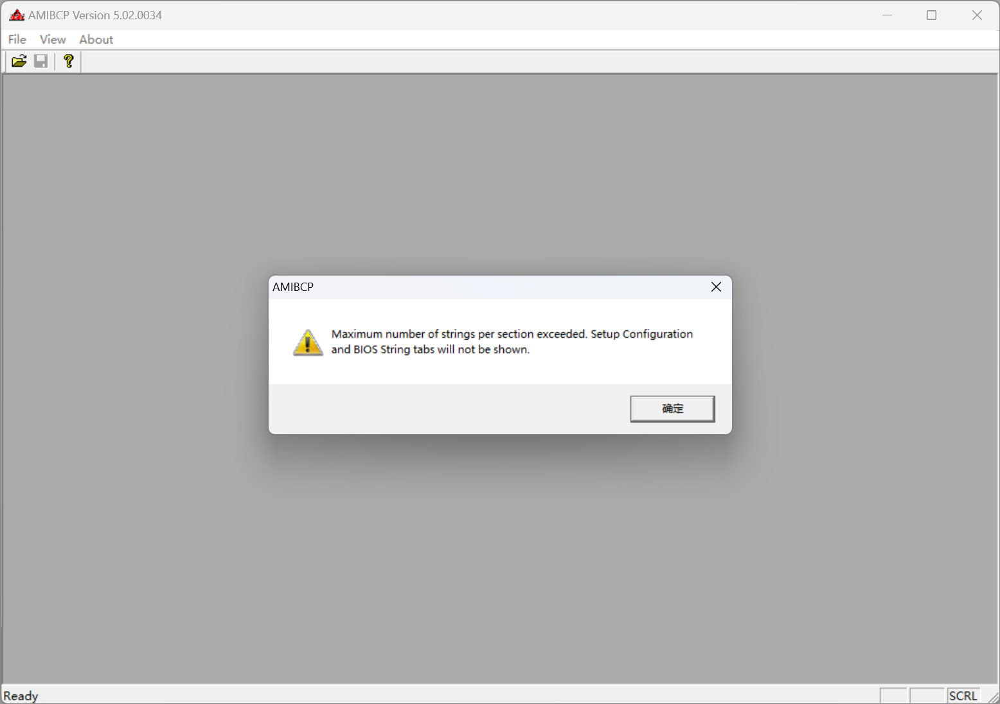
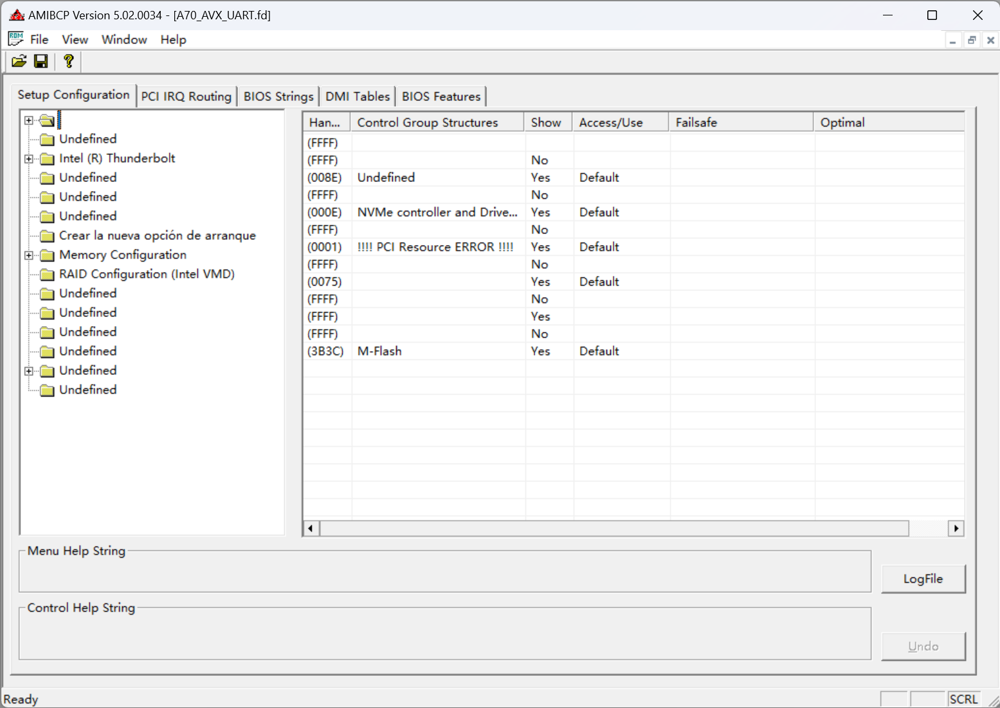

# Bypassing the string number limit of AMIBCP

[//]: # (AMI, Fuck You)

When modding AMI Aptio V BIOS of some modern platforms with AMIBCP, it is likely to report the "Maximum number of strings per section exceeded. Setup Configuration and BIOS Settings tabs will not be shown." error message. This post describes how to bypass this limitation by doing some pretty simple reverse engineering.



This post is based on AMIBCP 5.02.0034. It may vary between versions.


## Reverse engineering

The tool I used was [IDA Free](https://hex-rays.com/ida-free/). Searching for the string "Maximum number" through the application yields exactly what we want.

```assembly
.rdata:004ABCB0 aMaximumNumberO_0:                      ; DATA XREF: sub_41CED3+A59↑o
.rdata:004ABCB0                 text "UTF-16LE", 'Maximum number of strings per section exceeded. Set'
.rdata:004ABCB0                 text "UTF-16LE", 'up Configuration and BIOS String tabs will not be s'
.rdata:004ABCB0                 text "UTF-16LE", 'hown.',0
```

The code referencing this string is:

```assembly
.text:0041D928 loc_41D928:                             ; CODE XREF: sub_41CED3+64B↑j
.text:0041D928                 push    0
.text:0041D92A                 push    0
.text:0041D92C                 push    offset aMaximumNumberO_0 ; "Maximum number of strings per section e"...
.text:0041D931                 jmp     short loc_41D91E

.text:0041D517 loc_41D517:                             ; CODE XREF: sub_41CED3+63F↑j
.text:0041D517                 cmp     [ebp+78h+var_90], 2AF8h
.text:0041D51E                 jge     loc_41D928
```

Well, a straightforward `cmp` instruction. Since the following instruction is `jge`, `0x2af8` here is a signed int32.

I simply changed it to `0x7fffffff` and tried my luck. It works.




# Notes

The AMIBCP binary I use was downloaded from [this post on Win-Raid Forum](https://winraid.level1techs.com/t/latest-amibcp-for-11th-gen-i7/90256/8) the sha256 hash is `7fe28fb8a7419c95fba428891e5b3914d9e2b365a5a8932da74db52a1c1dabd8`.

If you are using the same version, you can use any hex editor to search the pattern `81 7D E8 F8 2A 00 00 (cmp dword ptr [ebp - 0x18], 0x2af8)` and change the immediate value in the last 4 bytes, like `81 7D E8 FF FF FF 7F` I used here.

